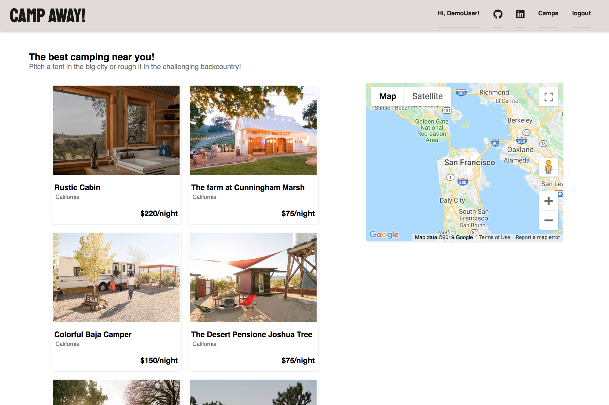
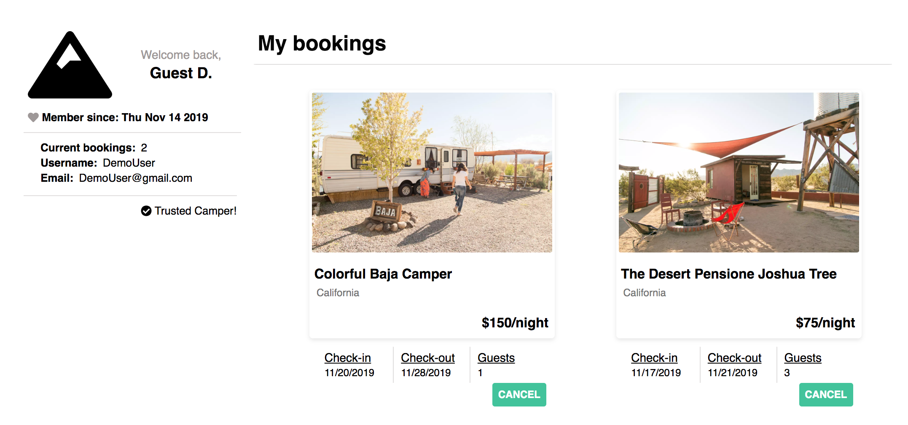

# Camp Away

[Live Site](https://camp-away-hipcamp.herokuapp.com/#/)

Camp Away is a full-stack clone of hipcamp.com, a booking website for camping.

## Technologies

* Ruby on Rails

* React.js

* Redux.js

* Node.js

* PostgreSQL

* Google Maps API

* Webpack

* Amazon AWS S3

Camp Away was built on a Ruby on Rails framework for the backend. PostgreSQL was used as the database to store the data along with Amazon AWS S3, which was used to store images for the camps. React and Redux was utilized to create a dynamic, single-page web app allowing users to smoothly navigate through the site. 

## Features

### User Auth

* Users can create an account on Camp Away and login to view their user profile.

* The login and signup forms are rendered on modals which were made using React.js components along with CSS

* Users who do not want to create an account are able to login as a demo user to navigate throughout the website and use it's features

### Camps

* Users can browse through the campgrounds

* The google maps API is used to help reference where the camps are

* The camps show page displays the details, essentials, amenities, and activities which render differently depending on availability 

* Users are also able to leave reviews on camp sites

### Bookings

* The booking form is on each of the camp's show page, allowing users to easily browse through individual sites whilst having access to book a camp

* A day picker was implemented using a react-day-picker to allow for users to choose a day on a calendar 

* A user can look at and cancel their bookings on their user profile page

